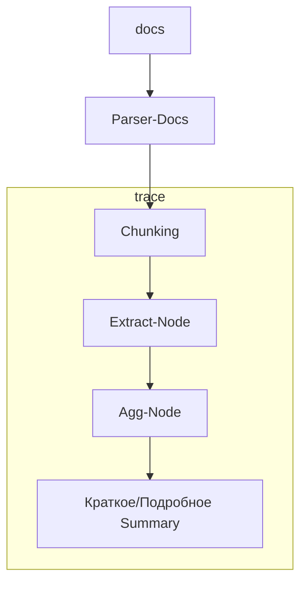

### Архитектура

1. docs как input(pdf, docx)
2. Парсер текста из docs
3. Чанкинг полученного текста
4. ExtractAgent
5. AggAgent
6. Output summary

#### Требования Парсера (2)
Парсер собирает текст по документам(учитывать заголовки, колонки и пр.)
Учитывая табличные данные в документах - (1) конвертировать после парсинга в md. (2) Текстовое описание строк.

#### Требования Чанкинг (3)
стратегии:
- Structure-aware.  режем по заголовкам, для кода по функциям. 
- Recursive text splitting: Сначала режем по "\n\n", потом по "\n", потом по пробелу.

#### Требования Extract-Node (4)
Выполняет параллельную обработку чанков. Извлекает ключевую информацию из каждого чанка. Возвращает структурированное представление данных по схеме.
Калькулятор - tool

#### Требования Agg-Node (5)
Собирает информацию чанков воедино. Проводит итоговую суммаризацию. С структурированным выводом. Возвращает краткое, подробное саммари, источники/номера страниц.

#### Примечания
Примечания по пунктам 4, 5 - агенты работают по фиксированному порядку, в  детерминированном процессе. Обеспечивается за счет графа и роутера.

Агенты объединены в один trace с N количеством наблюдений. С возможность получить feedback от юзера, через оценку (лайк=1, дизлайк=0). После нажатия дизлайка предполагает использование комментария, чтобы пользователь мог оставить подробный фидбек. Поддерживается версионность системных промптов.

БД:
- SummaryResult результат отработки
- user

### Инструментарий
1. langchain/langgraph
2. vllm - движок llm
3. lm-studio локальные тесты
4. langfuse - трассировка
5. Docling - парсер
6. fastapi
7. sqlalchemy
8. uv
9. python
10. docker
11. postgres
12. tuna

### LLM
qwen